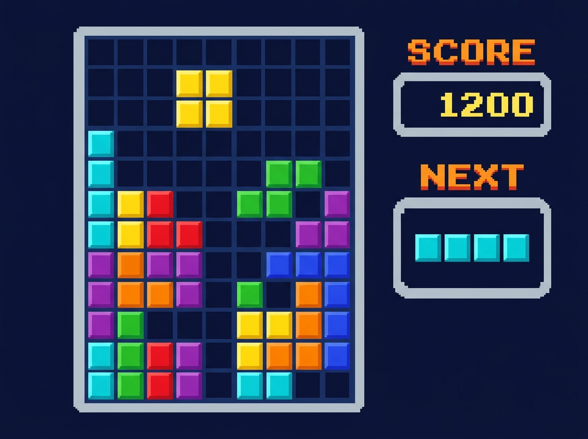

# 🎮 Raylib Tetris

[](https://isocpp.org/)
[](https://www.raylib.com/)
[]()
[]()

A retro-style classic **Tetris** game built in **C++17** using the lightweight and fast [Raylib](https://www.raylib.com/) graphics and audio library.



---

## 📋 Table of Contents

- [Features](#-features)
- [Game Controls](#-game-controls)
- [Scoring Rules](#-scoring-rules)
- [Prerequisites](#-prerequisites)
- [Installation & Building](#-installation--building)
  - [Linux / WSL](#linux--wsl)
  - [Windows (MinGW)](#windows-mingw)
  - [Build Configurations](#build-configurations)
- [Project Architecture](#-project-architecture)
- [Customization](#-customization)
- [Troubleshooting](#-troubleshooting)
- [License & Credits](#-license--credits)

---

## ✨ Features

- **Classic Gameplay**: Complete implementation of standard Tetris mechanics with all 7 classic tetrominoes (`I`, `J`, `L`, `O`, `S`, `T`, `Z`).
- **Smooth Piece Rotation & Movement**: Piece bounds checking, collision detection, and rotation wall-safeguards.
- **Next Piece Preview**: Dedicated UI panel showing the upcoming tetromino block.
- **Dynamic Score Tracking**: Real-time score updates with line-clear multipliers and soft-drop bonuses.
- **Audio & Retro Graphics**: Built-in 8-bit Tetris theme music (`Tetris.mp3`) and crisp retro typography using the Monogram font.
- **Game Over & Instant Restart**: Clear Game Over display and one-key restart mechanism.
- **Cross-Platform**: Ready to compile on Linux, Windows (MinGW), macOS, and WSL.

---

## 🎮 Game Controls

| Key | Action |
|:---:|:---|
| <kbd>⬅️ Left Arrow</kbd> | Move tetromino left |
| <kbd>➡️ Right Arrow</kbd> | Move tetromino right |
| <kbd>⬇️ Down Arrow</kbd> | Soft drop (fall faster) & gain +10 bonus points per push |
| <kbd>⬆️ Up Arrow</kbd> | Rotate tetromino 90° clockwise |
| <kbd>Any Key</kbd> | Restart game after **Game Over** |
| <kbd>ESC</kbd> | Exit game |

---

## 🏆 Scoring Rules

Points are awarded dynamically based on single and multi-line clears:

| Action | Score Awarded |
|:---|:---:|
| **Soft Drop** | `+10` points / step |
| **Single Line Clear** (1 row) | `+100` points |
| **Double Line Clear** (2 rows) | `+300` points |
| **Triple Line Clear** (3 rows) | `+500` points |
| **Tetris Clear** (4 rows) | `+800` points |

---

## 🔧 Prerequisites

- **C++ Compiler**: `g++` / MinGW with **C++17** support
- **Raylib**: Version 4.0 or newer
- **Make** (optional, for build automation)
- **System Libraries**:
  - OpenGL (`-lGL`)
  - Math & POSIX Threads (`-lm`, `-lpthread`)
  - System dynamic loader and X11 on Linux (`-ldl`, `-lrt`, `-lX11`)
  - Windows GDI, OpenGL & multimedia on Windows (`-lopengl32`, `-lgdi32`, `-lwinmm`)

---

## 🚀 Installation & Building

### 1. Clone the Repository

```bash
git clone https://github.com/NHP05/Raylib-Tetris.git
cd Raylib-Tetris
```

---

### Linux / WSL

#### Step 1: Install Raylib

```bash
sudo apt update
sudo apt install -y libraylib-dev
```

#### Step 2: Build & Run

**Option A — Using Makefile:**
```bash
# Compile
make

# Run
./game
```

**Option B — Using the automated build script:**
```bash
chmod +x build_and_run.sh
./build_and_run.sh
```

**Option C — Manual compilation:**
```bash
g++ -std=c++17 -Wall -Wno-missing-braces \
    -Isrc/raylib/src -Isrc \
    src/main.cpp src/game.cpp src/grid.cpp src/blocks.cpp \
    src/block.cpp src/position.cpp src/colors.cpp \
    -o game -lraylib -lGL -lm -lpthread -ldl -lrt -lX11
./game
```

---

### Windows (MinGW)

1. Make sure MinGW-w64 is installed and added to your `PATH`.
2. Install Raylib or link against dynamic / static Raylib libraries.
3. Compile using `g++`:

```bash
g++ -std=c++17 -Wall -Wno-missing-braces ^
    -Isrc ^
    src/main.cpp src/game.cpp src/grid.cpp src/blocks.cpp ^
    src/block.cpp src/position.cpp src/colors.cpp ^
    -o game.exe ^
    -lraylib -lopengl32 -lgdi32 -lwinmm

# Run
game.exe
```

---

### Build Configurations

The included `Makefile` provides several convenience targets:

```bash
make          # Standard release-ready build
make debug    # Build with debug symbols (-g -DDEBUG)
make release  # High-optimization build (-O3 -DNDEBUG)
make clean    # Remove build objects and binary
```

---

## 📁 Project Architecture

```
Raylib-Tetris/
├── Fonts/                    # UI fonts
│   └── monogram.ttf          # Pixel-art font for HUD
├── Sounds/                   # Audio files
│   └── Tetris.mp3            # Background theme music
├── lib/                      # Windows runtime support libraries
│   ├── libgcc_s_dw2-1.dll
│   └── libstdc++-6.dll
├── src/                      # C++ source code
│   ├── main.cpp              # Game entry point, 60 FPS loop, HUD rendering
│   ├── game.h / game.cpp     # Game manager, input handler, scoring & music
│   ├── grid.h / grid.cpp     # 10x20 grid matrix, collision & line clearing
│   ├── block.h / block.cpp   # Tetromino base class, rotations, drawing logic
│   ├── blocks.cpp            # Definitions for I, J, L, O, S, T, Z pieces
│   ├── colors.h / colors.cpp # Color scheme palette definitions
│   └── position.h / .cpp     # 2D grid coordinate utility
├── Makefile                  # Automated multi-target Makefile
├── build_and_run.sh          # One-click build & run bash script
├── preview.jpg               # Game screenshot preview
└── README.md                 # Project documentation
```

### Key Modules

- **`Game` (`game.cpp/h`)**: Controls audio lifecycle (`InitAudioDevice`, `LoadMusicStream`), piece spawning queue, rotation validation, soft drop timers, and score calculation.
- **`Grid` (`grid.cpp/h`)**: Maintains the 20-row × 10-column playing matrix, checks boundary bounds, identifies completed rows, and shifts rows downward.
- **`Block` (`block.cpp/h` & `blocks.cpp`)**: Encapsulates 4 rotation states for each of the 7 tetromino shapes with custom coordinate offsets.

---

## 🎨 Customization

You can easily tweak gameplay constants:

| Setting | File | Description |
|:---|:---|:---|
| **Drop Speed** | `src/main.cpp` | Adjust `EventTriggered(0.335)` (lower is faster) |
| **Grid Size** | `src/grid.cpp` | Change `numRows` (20), `numCols` (10), or `cellSize` (30) |
| **Colors** | `src/colors.cpp` | Customize RGBA palette for blocks and UI |
| **Audio** | `Sounds/Tetris.mp3` | Replace with your favorite MP3 track |
| **Window Dimensions** | `src/main.cpp` | Adjust `InitWindow(500, 620, "Tetris")` |

---

## 🐛 Troubleshooting

- **`raylib.h: No such file or directory`**:
  Make sure Raylib headers are in your include path (`-I/path/to/raylib/include` or `-Isrc/raylib/src`).
- **Music fails to play**:
  Check that the working directory contains `Sounds/Tetris.mp3` or that you run the binary from the root folder.
- **Font rendering issues**:
  Confirm `Fonts/monogram.ttf` (or `Font/monogram.ttf`) is accessible from the running directory.

---

## 📝 License & Credits

- Developed with ❤️ using [Raylib](https://www.raylib.com/)
- Original Tetris concept by Alexey Pajitnov
- This project is open source and intended for educational and hobby purposes.
